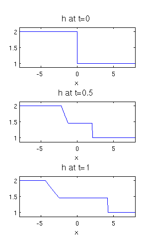

# SW_riemann_problem
Fluid depth            |  Fluid velocity
:-------------------------:|:-------------------------:
  |  


## Exact solutions of the Riemann problem for the shallow water equations: rarefaction waves, shocks, and contact discontinuities

This repository contains some MATLAB code and documentation on the Riemann problem for the one-dimensional shallow water equations (SWEs) with flat bottom topography. The SWEs are a nonlinear system of conservative hyperbolic partial differential equations (PDEs).

Exact solutions of the Riemann problem for this system exist and comprise different combinations of shock waves and centred rarefaction waves. The classical problem considered is the so called dam-break problem, in which flow is initially at rest (zero velocity) with a step discontinuity in water depth h and evolves with a left rarefaction wave and right shock wave (see above figures; fig. 2 in Kent, 2013).

The system is then extended to a one-dimensional symmetric system in which spatial variation in the y-direction is ignored at leading order. The inclusion of meridional velocity, which acts like a tracer, is manifest in the solutions as a contact discontinuity which separates the fluid into two regions of different meridional velocity.

Solving the Riemann problem is an essential element of the implementation of the (Godunov)finite volume numerical scheme and other modern numerical upwind schemes (see, e.g., [this repository](https://github.com/tkent198/wellbalanced_SW_DGFEM)).

The source code has been used to generate the figures in the attached [report](SWRiem.pdf) (Kent, 2013). The solutions have been derived in detail in Kent (2013), supported by a number of sources -- see LeVeque (2002), particularly chapter 13, for a thorough introduction to and discussion of the problem.

<!-- ---
## Contents

* [Introduction](#introduction)
  * [Motivation](#motivation)
  * [Description](#A-brief-description-of-Wetropolis)
  * [Taster](#taster)
  * [References](#references)
* [Getting started](#getting-started)
* [Code overview](#files-overview)
  * [MATLAB](#matlab)
  * [Python](#python)
* [Preliminary simulations](#preliminary-simulations)
--- -->


### References
* Kent, T. (2013): *Exact solution of the Riemann problem for the shallow water equations*. Tech. report. [PDF.](SWRiem.pdf)
* LeVeque, R. J. (2002). *Finite volume methods for hyperbolic problems*. Cambridge university press.
----

## Getting started
### Add Language, versions, etc.
* MATLAB '9.4.0.813654 (R2018a)'

### Files overview

File name                   |  Summary
:--------------------------:|:--------------------------:
```... .m```       |  ...
```... .m```    | ...


## Generating the figures in Kent (2013)
#### Figure 1
Similarity solution x/t of the dam-break Riemann problem for the shallow water equations with initial data: hl = 2; hr = 1; ul = ur = 0. Between the left and right initial states emerges a constant star state h*; in this case hl > h* > hr corresponding to a `left rarefaction wave - right shock' (LW-RS) Riemann solution.

<!--  -->

<p align="center">
  
</p>

Run ```swrpplots.m```: default setting with this initial data.
```
% choose syms h
hl=2; hr=1; ul=0; ur=0;
```
This is an example of a mixed Riemann solution comprising a rarefaction wave and a shock wave. The structure inside the rarefaction wave (i.e., in this case the curve connecting hl and h*) is given by equation (39) in Kent (2013).

*Exercise: Change hl, hr, ul, ur for different solutions. Find initial data that result in a LS-RW solution.*

#### Figure 2
Figure 2 illustrates the evolution of the depth h and fluid velocity u for the dam-break problem at certain times t with initial data hl = 2, hr = 1, and ul = ur = 0. The fluid  flows from left to right (i.e. from the region of higher depth to the region of lower depth) in a body that expands from the dam location at x = 0. On the left hand side of this body, the fluid moves away from the deeper stationary fluid through a rarefaction wave. On the right, fluid with intermediate depth h and velocity u collides with the stationary fluid at a lower depth, instantaneously accelerating it through a shock wave.
<p align="center">
  
  
</p>
Run ```husubplots.m```: default setting with this initial data.
```
% choose time-snaps
tn = 0:0.5:1;
% choose syms h
hl = 2;
hr = 1;
ul = 0;
ur = 0;
```
*Exercise: Change hl, hr, ul, ur for different solutions; plot at different times.=.*
